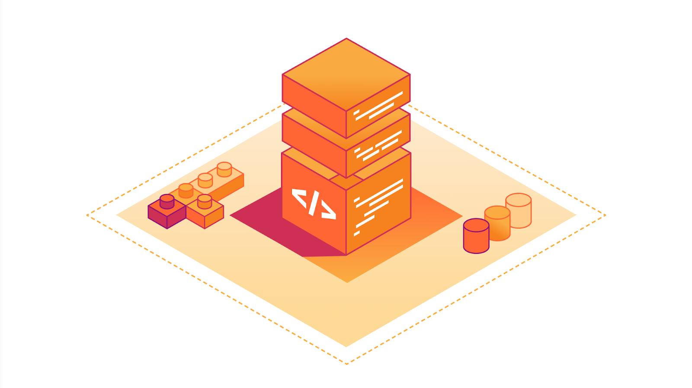

# Foundations

    

Foundations is a foundational Rust library, designed to help scale programs for distributed,
production-grade systems. It enables engineers to concentrate on the core business logic
of their services, rather than the intricacies of production operation setups.

If you need any of those:

* logging
* distributed tracing
* metrics
* memory profiling and [jemalloc](https://github.com/jemalloc/jemalloc) allocator
* security features, such as [seccomp](https://en.wikipedia.org/wiki/Seccomp)-based syscall sandboxing
* service configuration with documentation
* CLI helper that takes care of the configuration loading

then Foundations is a tool of choice for you.

## Documentation

https://docs.rs/foundations/

## License

BSD-3 licensed. See the [LICENSE](LICENSE) file for details.